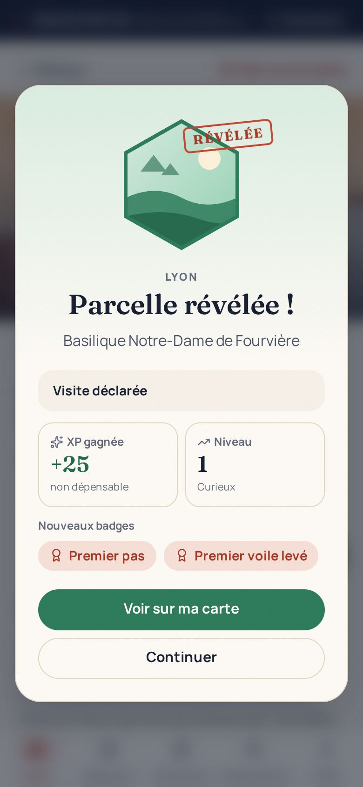

# HORIZON

**Découvre des lieux. Vis des expériences. Révèle ton monde.**

Application web mobile-first (PWA) de découverte et d'exploration :

- une carte personnelle qui se révèle au fil des visites (parcelles H3) ;
- « Surprends-nous », qui compose une sortie de 3 à 5 étapes ;
- un passeport d'exploration partageable ;
- le référencement (compte requis) : proposer un restaurant, un commerce ou une activité (publié après modération), revendiquer la fiche de son établissement (retrait de la gestion par l'administrateur ou renoncement possible), avis après visite déclarée et réponses des établissements ;
- le Mode Duo (compte requis) : préparer une excursion à deux avec un ami et déclarer une visite pour les deux, confirmée par l'autre.

Nom provisoire : sa disponibilité et celle du domaine n'ont pas été vérifiées. Dépôt privé, aucune licence open source accordée.

> **État :** prototype fonctionnel.
>
> - Le mode démonstration est livré et testé de bout en bout.
> - Le mode connecté (comptes, base PostgreSQL, amis, Mode Duo, référencement, partage, avis modérés, missions, administration) est testé sur une pile Supabase **locale**, pas sur un projet hébergé.
>
> Chaque vérification porte un statut (RÉUSSIE, ÉCHOUÉE ou NON EXÉCUTÉE) dans `docs/STATUS.md`. Les limites figurent dans `docs/KNOWN_LIMITATIONS.md`.



## Prérequis

- Node.js ≥ 22.12 (testé avec 22.22.2) et npm 10.
- Tests de bout en bout : Chromium via Playwright (`npx playwright install chromium`, sauf navigateur compatible préinstallé).
- Mode connecté : Docker, pour la pile Supabase locale (`npm run supabase:start`), ou un projet Supabase.

## Démarrage rapide (mode démo, sans aucune clé)

```bash
npm ci
npm run dev          # http://localhost:3000 → « Essayer la démo »
```

En démo :

- les lieux ne sont pas vérifiés ; les restaurants, amis et avis sont fictifs ;
- un bandeau « Démonstration » le rappelle en permanence ;
- la progression reste dans le navigateur, et « Réinitialiser » l'efface.

## Mode connecté (local)

```bash
npm run supabase:start                      # pile Supabase locale (Docker)
npm run supabase:reset                      # migrations + seed
npx supabase@2.117.0 status -o env          # URL, clé publiable, DB_URL → .env.local
npm run dev:connected
```

Détails :

- **Variables :** voir `.env.example`. Si l'une manque, l'application affiche une erreur de configuration ; elle ne bascule jamais en démo.
- **Compte de test :** aucun compte n'est livré. En créer un depuis `/connexion` (la confirmation d'e-mail est désactivée en local).
- **Administrateur :** `DATABASE_URL=... npm run admin:grant -- personne@exemple.fr`, puis `/admin`.

Guide complet : `docs/HANDOVER.md`.

## Commandes

| Commande | Rôle |
|---|---|
| `npm run dev` / `npm run dev:connected` | Serveur de développement (démo / connecté) |
| `npm run build:demo` puis `npm start` | Build de production en démo |
| `npm run typecheck` | Types (routes générées + tsc) |
| `npm run lint` | ESLint |
| `npm test` | Tests unitaires (Vitest) |
| `npm run test:e2e` | Parcours de recette démo, Playwright (après `npm run build:demo`) |
| `npm run test:db` | Intégration sur PostgreSQL/PostGIS réel (pile Supabase locale) |
| `npm run test:e2e:connected` | Parcours connectés (pile Supabase locale démarrée) |
| `npm run verify` | typecheck + lint + tests + build |
| `npm run db:seed:sql` | Régénère `supabase/seed.sql` depuis le catalogue |
| `npm run admin:grant` | Accorde ou retire le rôle administrateur |
| `npm run mail:flush` | Envoie les e-mails en file, relance, purge (à planifier en production) |
| `npm run basemap:build` | Régénère le fond Natural Earth (réseau requis) |
| `node scripts/screenshots.mjs` | Captures réelles (serveur démo sur le port 3100) |

## Services externes

Aucun service externe n'est nécessaire en démo. Sans fournisseur :

- la carte utilise un fond local simplifié (Natural Earth, domaine public, sans rues) ;
- la météo est affichée comme indisponible ;
- les distances sont à vol d'oiseau, étiquetées comme telles.

Fournisseurs optionnels, non vérifiés :

- style de tuiles MapLibre ;
- Open-Meteo ;
- Supabase hébergé ;
- SMTP.

## Documentation

- `CLAUDE.md` — consignes de travail pour Claude Code ;
- `docs/PRODUCT_SPEC.md` — spécification ;
- `docs/IMPLEMENTATION_PLAN.md` — plan priorisé et état ;
- `docs/DECISIONS.md` — décisions structurantes ;
- `docs/STATUS.md` — état vérifié ;
- `docs/HANDOVER.md` — reprise technique (architecture, données, déploiement, sauvegardes, données personnelles) ;
- `docs/KNOWN_LIMITATIONS.md` — ce qui est simulé, non vérifié ou non livré ;
- `docs/DEMO_SCRIPT.md` — scénario de démonstration avec captures réelles ;
- `docs/ASSET_REGISTER.md` — actifs et licences ;
- `docs/ACQUISITION_BRIEF.md` — note de présentation, sans chiffres inventés ;
- `docs/OPERATING_COSTS.md` — postes de coûts, montants à vérifier.
